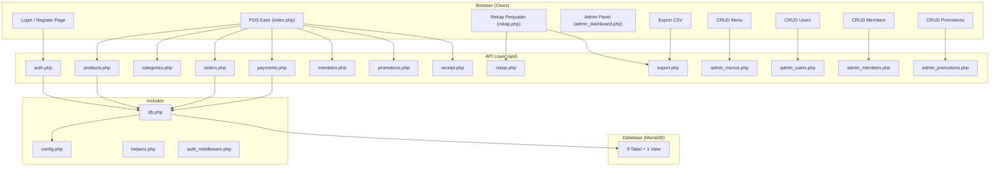
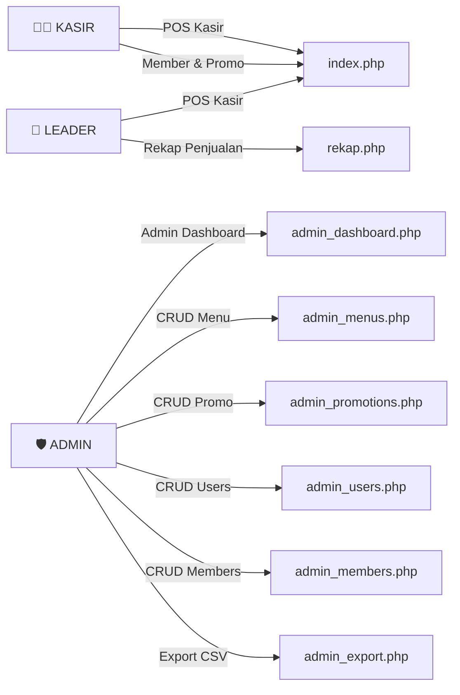
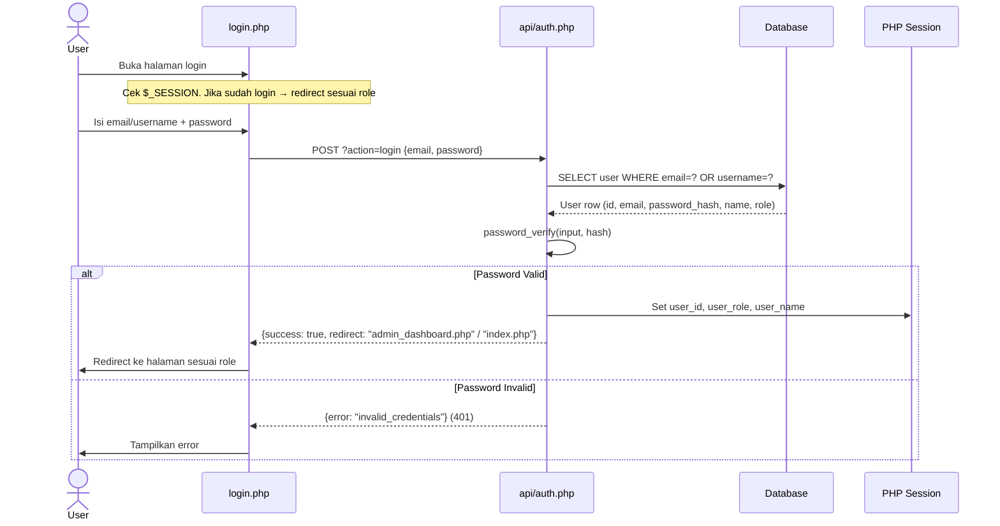
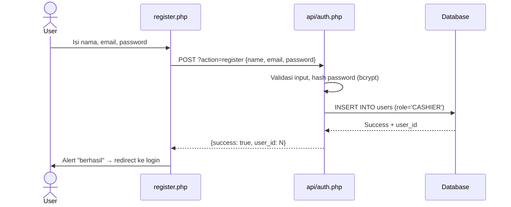
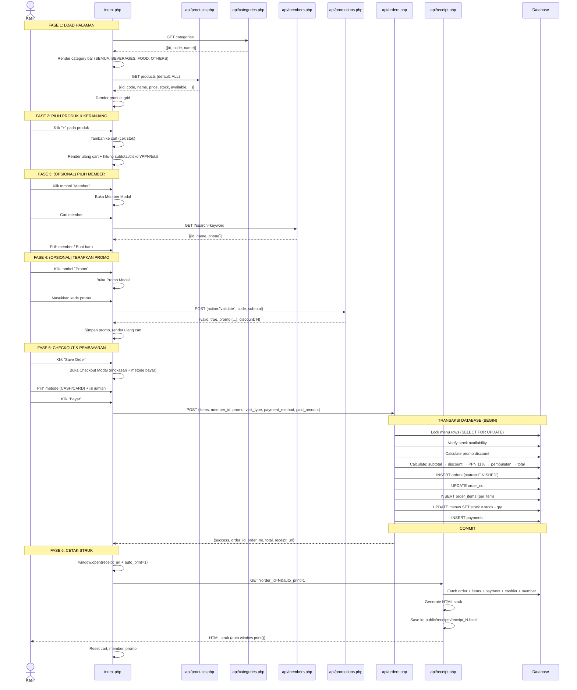
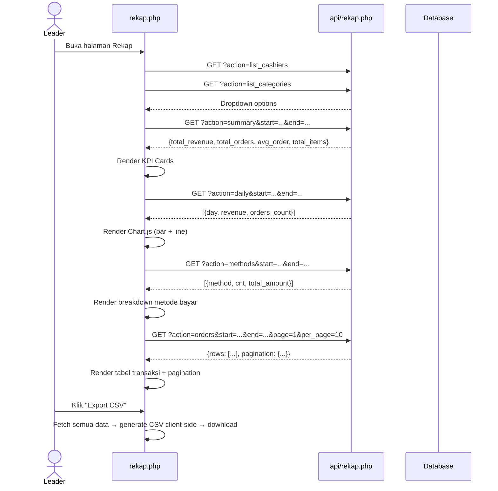
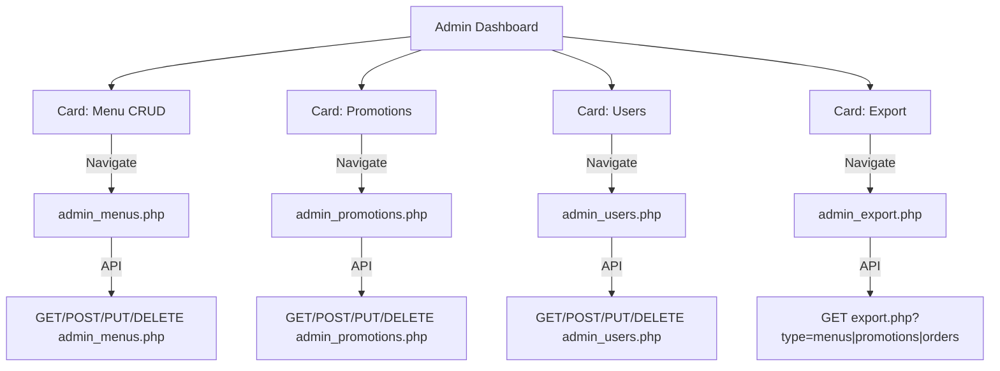

# 📋 Dokumentasi Lengkap: Aplikasi Kasir Jus POS (JusPos)

> **Tujuan dokumen ini**: Memberikan pemahaman menyeluruh tentang seluruh aspek project Aplikasi Kasir Jus POS — termasuk arsitektur, database, alur aktor, API, frontend, dan logika bisnis — sehingga AI model atau developer mana pun dapat langsung memahami dan bekerja dengan codebase ini.

---

## 1. Ringkasan Proyek

**JusPos** adalah aplikasi Point of Sale (POS) berbasis web untuk toko jus. Aplikasi ini mengelola seluruh proses penjualan mulai dari pemilihan menu, pengelolaan keranjang, penerapan promo/diskon, pembayaran, pencetakan struk, hingga rekap penjualan dan panel administrasi.

| Aspek | Detail |
|-------|--------|
| **Nama Aplikasi** | POS Toko Jus (JusPos) |
| **Bahasa Backend** | PHP 8.3+ (native, tanpa framework) |
| **Database** | MariaDB 10.4 (MySQL-compatible) |
| **Frontend** | HTML + JavaScript (vanilla) + TailwindCSS (CDN) |
| **Web Server** | Apache (XAMPP) |
| **Chart Library** | Chart.js (CDN, di halaman Rekap) |
| **Mata Uang** | Rupiah (IDR) |
| **PPN** | 11% (hardcoded) |
| **Pembulatan** | Ke kelipatan Rp 100 terdekat |

---

## 2. Arsitektur Sistem



### Pola Komunikasi
- **Frontend → Backend**: Semua komunikasi via `fetch()` API (AJAX) dengan format JSON
- **Autentikasi**: PHP native session (`$_SESSION`)
- **Database**: PDO dengan prepared statements (parameter binding)

---

## 3. Struktur Direktori

```
juspos/
├── .gitignore                    # Exclude: config, db, receipts, node_modules
├── package.json                  # Node dependencies (TailwindCSS build tools)
├── tailwind.config.js            # Konfigurasi Tailwind (content scan)
├── readme.md                     # Readme sederhana
│
├── juspos (3).sql                # Full database dump (schema + data)
│
├── migrations/
│   └── converted_mysql_schema.sql  # Schema DDL bersih (untuk setup awal)
│
├── seed/
│   └── seed_data.sql             # Data awal (categories, menus, members, promotions)
│
├── scripts/
│   └── create_admin.php          # CLI script untuk membuat user demo (kasir, leader, admin)
│
├── includes/                     # Shared PHP utilities
│   ├── config.php                # Konstanta: DB_HOST, DB_NAME, DB_USER, DB_PASS, BASE_URL, RECEIPT_PATH
│   ├── db.php                    # Inisialisasi PDO connection ($pdo)
│   ├── helpers.php               # jsonResponse(), formatRupiah(), generateReceiptHtml()
│   └── auth_middleware.php       # require_login(), require_role()
│
├── api/                          # Backend API endpoints (JSON)
│   ├── auth.php                  # Login, Register, Logout
│   ├── categories.php            # GET daftar kategori
│   ├── products.php              # GET produk (filter kategori/search), POST create (admin)
│   ├── orders.php                # POST create order (full transaction)
│   ├── payments.php              # POST create payment (standalone)
│   ├── members.php               # GET search member, POST create member
│   ├── promotions.php            # GET aktif promos, POST validate kode promo
│   ├── receipt.php               # GET generate HTML struk (cetak/reprint)
│   ├── rekap.php                 # GET data rekap (summary, daily, group, methods, orders)
│   ├── export.php                # GET export CSV (menus, promotions, orders)
│   ├── admin_menus.php           # CRUD menu (GET/POST/PUT/DELETE)
│   ├── admin_users.php           # CRUD users (GET/POST/PUT/DELETE)
│   ├── admin_members.php         # CRUD members (GET/POST/PUT/DELETE)
│   └── admin_promotions.php      # CRUD promotions (GET/POST/PUT/DELETE)
│
├── public/                       # Frontend pages (PHP + embedded JS)
│   ├── login.php                 # Halaman login
│   ├── register.php              # Halaman registrasi
│   ├── index.php                 # **HALAMAN UTAMA POS KASIR** (~1241 baris)
│   ├── rekap.php                 # Halaman rekap/laporan penjualan
│   ├── admin_dashboard.php       # Admin panel - dashboard
│   ├── admin_menus.php           # Admin panel - CRUD menu
│   ├── admin_users.php           # Admin panel - CRUD users
│   ├── admin_members.php         # Admin panel - CRUD members
│   ├── admin_promotions.php      # Admin panel - CRUD promotions
│   ├── admin_export.php          # Admin panel - export CSV
│   ├── assets/                   # (kosong - aset statis jika diperlukan)
│   └── receipts/                 # Output HTML struk yang di-generate
│       ├── receipt_18.html
│       ├── receipt_20.html
│       ├── receipt_21.html
│       ├── receipt_22.html
│       └── template_receipt.html
│
└── node_modules/                 # Dependencies (auto-generated)
```

---

## 4. Skema Database

### 4.1 Entity Relationship Diagram (ERD)

```mermaid
erDiagram
    users ||--o{ orders : "membuat"
    members ||--o{ orders : "terhubung"
    categories ||--o{ menus : "memiliki"
    menus ||--o{ order_items : "dipesan"
    orders ||--o{ order_items : "berisi"
    orders ||--o{ payments : "dibayar"
    orders ||--o{ receipts : "punya struk"
    orders ||--o{ promo_applied : "menggunakan promo"
    promotions ||--o{ promo_applied : "diterapkan"

    users {
        int id PK
        varchar auth_uuid
        varchar username UK
        varchar email UK
        varchar password_hash
        varchar name
        varchar phone
        varchar role "KASIR, LEADER, ADMIN"
        datetime created_at
    }

    categories {
        int id PK
        varchar code UK
        varchar name
        datetime created_at
    }

    menus {
        int id PK
        int category_id FK
        varchar code UK
        varchar name
        decimal price
        int stock
        tinyint available
        text description
        datetime created_at
    }

    members {
        int id PK
        varchar code UK
        varchar name
        varchar phone
        datetime created_at
    }

    orders {
        int id PK
        varchar visit_type "DINE, TAKEAWAY"
        varchar status "PENDING, FINISHED, CANCELLED"
        int member_id FK
        int user_id FK
        decimal subtotal
        decimal discount
        decimal total
        datetime created_at
        varchar order_no UK
    }

    order_items {
        int id PK
        int order_id FK
        int menu_id FK
        int qty
        decimal price
        datetime created_at
    }

    payments {
        int id PK
        int order_id FK
        varchar method "CASH, CARD, VOUCHER"
        decimal amount
        string meta
        datetime created_at
    }

    promotions {
        int id PK
        varchar code UK
        varchar type "BUNDLE, PERCENT, AMOUNT"
        decimal value
        tinyint active
        datetime starts_at
        datetime ends_at
        datetime created_at
    }

    promo_applied {
        INT_UNSIGNED id PK
        INT_UNSIGNED order_id FK
        INT_UNSIGNED promo_id FK
        JSON meta
        DATETIME created_at
    }

    receipts {
        INT_UNSIGNED id PK
        INT_UNSIGNED order_id FK_UK
        TEXT file_path
        DATETIME created_at
    }
```

### 4.2 Detail Tabel

#### `users` — Pengguna sistem
| Kolom | Tipe | Keterangan |
|-------|------|------------|
| `id` | INT UNSIGNED PK AI | ID unik |
| `auth_uuid` | VARCHAR(36) | UUID opsional (reserved untuk integrasi auth eksternal) |
| `username` | VARCHAR(100) UNIQUE | Username login |
| `email` | VARCHAR(254) UNIQUE | Email login |
| `password_hash` | VARCHAR(255) | Hash bcrypt (PASSWORD_DEFAULT) |
| `name` | VARCHAR(150) | Nama tampilan |
| `phone` | VARCHAR(50) | Nomor telepon (opsional) |
| `role` | ENUM('KASIR','LEADER','ADMIN') | Peran user |
| `created_at` | DATETIME | Waktu pembuatan |

#### `categories` — Kategori menu
| Kolom | Tipe | Keterangan |
|-------|------|------------|
| `id` | INT UNSIGNED PK AI | ID unik |
| `code` | VARCHAR(50) UNIQUE | Kode: BEVERAGE, FOOD, OTHERS |
| `name` | VARCHAR(150) | Nama kategori |
| `created_at` | DATETIME | Waktu pembuatan |

**Data aktual**: `BEVERAGE` (Beverages), `FOOD` (Food), `OTHERS` (Others)

#### `menus` — Item menu / produk
| Kolom | Tipe | Keterangan |
|-------|------|------------|
| `id` | INT UNSIGNED PK AI | ID unik |
| `category_id` | INT UNSIGNED FK → categories.id | Kategori (ON DELETE SET NULL) |
| `code` | VARCHAR(50) UNIQUE | Kode produk (e.g., BEV-001) |
| `name` | VARCHAR(150) | Nama produk |
| `price` | DECIMAL(12,2) | Harga satuan (IDR) |
| `stock` | INT | Jumlah stok tersedia |
| `available` | TINYINT(1) | 1 = tersedia, 0 = tidak |
| `description` | TEXT | Deskripsi produk |
| `created_at` | DATETIME | Waktu pembuatan |

#### `members` — Pelanggan member
| Kolom | Tipe | Keterangan |
|-------|------|------------|
| `id` | INT UNSIGNED PK AI | ID unik |
| `code` | VARCHAR(50) UNIQUE | Kode member (e.g., M001, M7737) |
| `name` | VARCHAR(150) | Nama member |
| `phone` | VARCHAR(50) | Nomor telepon |
| `created_at` | DATETIME | Waktu pembuatan |

> **Catatan**: Migration schema memiliki kolom `points` (INT DEFAULT 0) tapi di dump SQL aktual tidak ada — fitur poin belum sepenuhnya diimplementasi.

#### `orders` — Transaksi/pesanan
| Kolom | Tipe | Keterangan |
|-------|------|------------|
| `id` | INT UNSIGNED PK AI | ID unik |
| `visit_type` | ENUM('DINE','TAKEAWAY') | Tipe kunjungan |
| `status` | ENUM('PENDING','FINISHED','CANCELLED') | Status order |
| `member_id` | INT UNSIGNED FK → members.id | Member terkait (opsional, ON DELETE SET NULL) |
| `user_id` | INT UNSIGNED FK → users.id | Kasir yang memproses (ON DELETE SET NULL) |
| `subtotal` | DECIMAL(12,2) | Subtotal sebelum diskon & pajak |
| `discount` | DECIMAL(12,2) | Jumlah diskon |
| `total` | DECIMAL(12,2) | Total akhir setelah diskon + PPN + pembulatan |
| `created_at` | DATETIME | Waktu pembuatan |
| `order_no` | VARCHAR(50) UNIQUE | Nomor order (format: SRPM + YYYYMMDD + 4 digit random) |

#### `order_items` — Detail item dalam pesanan
| Kolom | Tipe | Keterangan |
|-------|------|------------|
| `id` | INT UNSIGNED PK AI | ID unik |
| `order_id` | INT UNSIGNED FK → orders.id | Order terkait (ON DELETE CASCADE) |
| `menu_id` | INT UNSIGNED FK → menus.id | Menu/produk yang dipesan |
| `qty` | INT | Jumlah item |
| `price` | DECIMAL(12,2) | Harga satuan pada saat pemesanan (snapshot) |
| `created_at` | DATETIME | Waktu pembuatan |

#### `payments` — Catatan pembayaran
| Kolom | Tipe | Keterangan |
|-------|------|------------|
| `id` | INT UNSIGNED PK AI | ID unik |
| `order_id` | INT UNSIGNED FK → orders.id | Order terkait (ON DELETE CASCADE) |
| `method` | ENUM('CASH','CARD','VOUCHER') | Metode pembayaran |
| `amount` | DECIMAL(12,2) | Jumlah yang dibayar |
| `meta` | JSON | Metadata tambahan (e.g., `{"paid_amount": 88800}`) |
| `created_at` | DATETIME | Waktu pembayaran |

#### `promotions` — Promosi/diskon
| Kolom | Tipe | Keterangan |
|-------|------|------------|
| `id` | INT UNSIGNED PK AI | ID unik |
| `code` | VARCHAR(50) UNIQUE | Kode promo (e.g., WELCOME10) |
| `type` | ENUM('BUNDLE','PERCENT','AMOUNT') | Tipe diskon |
| `value` | DECIMAL(12,2) | Nilai diskon (persentase atau jumlah tetap) |
| `active` | TINYINT(1) | 1 = aktif, 0 = nonaktif |
| `starts_at` | DATETIME | Tanggal mulai berlaku (opsional) |
| `ends_at` | DATETIME | Tanggal berakhir (opsional) |
| `created_at` | DATETIME | Waktu pembuatan |

#### `promo_applied` — Log penerapan promo per order
| Kolom | Tipe | Keterangan |
|-------|------|------------|
| `id` | INT UNSIGNED PK AI | ID unik |
| `order_id` | INT UNSIGNED FK → orders.id | Order yang menggunakan promo (CASCADE) |
| `promo_id` | INT UNSIGNED FK → promotions.id | Promo yang diterapkan (CASCADE) |
| `meta` | JSON | Metadata (e.g., `{"code":"WELCOME10"}`) |
| `created_at` | DATETIME | Waktu penerapan |

#### `receipts` — File struk yang di-generate
| Kolom | Tipe | Keterangan |
|-------|------|------------|
| `id` | INT UNSIGNED PK AI | ID unik |
| `order_id` | INT UNSIGNED FK UK → orders.id | Order terkait (unique, CASCADE) |
| `file_path` | TEXT | Path relatif ke file HTML struk |
| `created_at` | DATETIME | Waktu pembuatan |

#### `v_daily_sales` — View (virtual)
View yang meringkas penjualan harian dari order berstatus `FINISHED`:
```sql
SELECT 
  CAST(o.created_at AS DATE) AS day,
  COUNT(DISTINCT o.id)        AS orders_count,
  COALESCE(SUM(o.total), 0)   AS revenue,
  COALESCE(SUM(oi.qty), 0)    AS items_sold
FROM orders o 
LEFT JOIN order_items oi ON oi.order_id = o.id
WHERE o.status = 'FINISHED'
GROUP BY CAST(o.created_at AS DATE)
```

### 4.3 Indexes
| Tabel | Index | Kolom |
|-------|-------|-------|
| orders | `idx_orders_created_at` | created_at |
| orders | `ux_orders_order_no` | order_no (UNIQUE) |
| order_items | `idx_order_items_order_id` | order_id |
| payments | `idx_payments_order_id` | order_id |
| payments | `idx_payments_method` | method |
| payments | `idx_payments_created_at` | created_at |

---

## 5. Role-Based Access Control (RBAC)

### 5.1 Tiga Role Utama



### 5.2 Matriks Akses

| Fitur | KASIR | LEADER | ADMIN |
|-------|:-----:|:------:|:-----:|
| Login / Register | ✅ | ✅ | ✅ |
| POS Kasir (index.php) | ✅ | ✅ | ❌ (redirect ke admin) |
| Buat Order & Pembayaran | ✅ | ✅ | ❌ |
| Member Search & Create | ✅ | ✅ | ✅ |
| Gunakan Kode Promo | ✅ | ✅ | ❌ |
| Tombol Rekap (di header) | ❌ | ✅ | ❌ |
| Rekap Penjualan (rekap.php) | ❌* | ✅ | ❌ |
| Admin Dashboard | ❌ | ✅** | ✅ |
| CRUD Menu | ❌ | ❌ | ✅ |
| CRUD Users | ❌ | ❌ | ✅ |
| CRUD Members (Admin) | ❌ | ❌ | ✅ |
| CRUD Promotions | ❌ | ❌ | ✅ |
| Export CSV | ❌ | ✅ | ✅ |

> \* Rekap accessible secara URL tapi tombolnya hanya muncul untuk LEADER  
> \*\* Admin dashboard accessible oleh LEADER juga (cek di kode: `in_array($userRole, ['ADMIN', 'LEADER'])`)

### 5.3 Redirect Setelah Login

| Role | Redirect Ke |
|------|------------|
| ADMIN | `admin_dashboard.php` |
| LEADER | `index.php` (POS + tombol Rekap) |
| KASIR | `index.php` (POS saja) |

### 5.4 User Demo (Akun Bawaan)

| Username | Email | Password | Role |
|----------|-------|----------|------|
| `kasir01` | laksa@tokojus.com | password123 | KASIR |
| `leader01` | hapis@tokojus.com | password123 | LEADER |
| `admin` | admin@tokojus.com | admin123 | ADMIN |

---

## 6. Alur Aktor & Flow Bisnis

### 6.1 Flow Autentikasi



### 6.2 Flow Registrasi



> **Catatan**: Register selalu membuat user dengan role `CASHIER` (hardcoded di API).

### 6.3 Flow POS Kasir (Membuat Transaksi)

Ini adalah flow utama aplikasi:



### 6.4 Kalkulasi Harga (Detail)

```
Subtotal  = Σ (item.price × item.qty)
Discount  = Berdasarkan promo:
            - PERCENT: subtotal × (value / 100)
            - AMOUNT:  value (fixed amount)
            - BUNDLE:  (tidak diimplementasi di frontend)
After     = MAX(0, subtotal - discount)
Tax (PPN) = after × 0.11
Raw Total = after + tax
Total     = ROUND(raw_total / 100) × 100    ← pembulatan ke Rp 100 terdekat
Rounding  = raw_total - total
```

### 6.5 Flow Rekap Penjualan (LEADER)



**Fitur Rekap**:
- **Filter**: Rentang tanggal, kasir, metode bayar, kategori
- **Preset**: Hari ini, 7 hari, 30 hari, Bulan ini
- **Group by**: Day, Week, Month, Category
- **Chart**: Bar chart (pendapatan) + Line chart (jumlah transaksi) via Chart.js
- **Export**: Client-side CSV generation + download

### 6.6 Flow Admin Panel



#### Admin CRUD Pattern (Sama untuk Menu, Users, Members, Promotions)

Setiap admin CRUD page mengikuti pola yang sama:
1. **List** (GET): Tabel dengan pagination + search
2. **Create** (POST): Modal form → simpan → refresh list
3. **Edit** (PUT): Ambil data by ID → populate modal → update → refresh
4. **Delete** (DELETE): Konfirmasi → hapus → refresh

---

## 7. API Reference Lengkap

### 7.1 Authentication API (`api/auth.php`)

| Endpoint | Method | Parameter | Auth | Response |
|----------|--------|-----------|------|----------|
| `?action=register` | POST | `{email, password, name}` | ❌ | `{success, user_id}` |
| `?action=login` | POST | `{email, password}` | ❌ | `{success, user:{id,email,role,name}, redirect}` |
| `?action=logout` | GET | — | ✅ Session | `{success: true}` atau redirect ke login.php |

**Detail Login**:
- Bisa login via email ATAU username
- Session regenerated setelah login (security)
- Response include `redirect` field berdasarkan role

### 7.2 Categories API (`api/categories.php`)

| Endpoint | Method | Parameter | Auth | Response |
|----------|--------|-----------|------|----------|
| `/` | GET | — | ❌ | `[{id, code, name}]` |

### 7.3 Products API (`api/products.php`)

| Endpoint | Method | Parameter | Auth | Response |
|----------|--------|-----------|------|----------|
| `/` | GET | `?category=CODE&search=term` | ❌ | `[{id, code, name, price, stock, available, description, category_code, category_name}]` |
| `/` | POST | `{code, name, price, stock, description, category_code}` | ✅ ADMIN only | `{success, menu_id}` |

### 7.4 Orders API (`api/orders.php`)

| Endpoint | Method | Parameter | Auth | Response |
|----------|--------|-----------|------|----------|
| `/` | POST | `{items:[{menu_id, qty}], member_id, promo, visit_type, payment_method, paid_amount}` | ✅ Session | `{success, order_id, order_no, total, receipt_url}` |

**Business Logic dalam Orders API**:
1. Cek kolom-kolom tabel secara dinamis (INFORMATION_SCHEMA) untuk kompatibilitas
2. Start transaction
3. Lock menu rows (`FOR UPDATE`) untuk prevent race condition
4. Validasi stok: `stock >= qty`
5. Hitung subtotal server-side (tidak trust client)
6. Lookup & apply promo jika ada
7. Kalkulasi: subtotal → discount → PPN 11% → pembulatan ke 100 → total
8. Insert order (status = FINISHED langsung)
9. Generate order_no: `SRPM` + `YYYYMMDD` + 4 digit random
10. Insert order_items + decrement stock
11. Insert payment record
12. Commit

### 7.5 Payments API (`api/payments.php`)

| Endpoint | Method | Parameter | Auth | Response |
|----------|--------|-----------|------|----------|
| `/` | POST | `{order_id, amount, method, meta}` | ✅ Session | `{success: true}` |

**Standalone payment endpoint** (terpisah dari orders.php):
- Fetch order total, verifikasi amount match
- Insert payment record
- Update order status ke FINISHED

### 7.6 Members API (`api/members.php`)

| Endpoint | Method | Parameter | Auth | Response |
|----------|--------|-----------|------|----------|
| `/` | GET | `?search=keyword` | ❌ | `[{id, code, name, phone, points}]` |
| `/` | POST | `{name, phone}` | ❌ | `{success, member_id}` |

### 7.7 Promotions API (`api/promotions.php`)

| Endpoint | Method | Parameter | Auth | Response |
|----------|--------|-----------|------|----------|
| `/` | GET | — | ❌ | `[{id, code, type, value, starts_at, ends_at, active}]` |
| `/` | POST | `{action:"validate", code, subtotal}` | ❌ | `{valid, promo:{...}, discount}` |

**Validasi Promo**:
- Cek `active = 1`
- Cek rentang tanggal (`starts_at` / `ends_at`) jika ada
- Hitung discount berdasarkan `type` (PERCENT / AMOUNT)

### 7.8 Receipt API (`api/receipt.php`)

| Endpoint | Method | Parameter | Auth | Response |
|----------|--------|-----------|------|----------|
| `/` | GET | `?order_id=N[&reprint=1][&auto_print=1]` | ❌ | **HTML** (bukan JSON) |

**Output**: Halaman HTML struk berformat thermal printer (280px width, monospace font) yang berisi:
- Info toko (nama, alamat, telepon)
- Nomor order, tanggal, kasir, tipe kunjungan
- Daftar item (qty × nama = total per item)
- Subtotal, promo, PPN 11%, pembulatan, GRAND TOTAL
- Metode & jumlah bayar
- Footer "Terima kasih"
- Tombol "Cetak Struk" (non-print media)
- Auto print via `window.print()` jika `auto_print=1`

File struk juga disimpan ke `public/receipts/receipt_{order_id}.html`.

### 7.9 Rekap API (`api/rekap.php`)

| Action | Method | Parameter | Auth | Response |
|--------|--------|-----------|------|----------|
| `summary` | GET | `start, end` | ❌ | `{total_revenue, total_orders, total_items, avg_order}` |
| `daily` | GET | `start, end` | ❌ | `{data: [{day, revenue, orders_count}]}` |
| `group` | GET | `type=category, start, end` | ❌ | `{data: [{category_id, label, revenue, items}]}` |
| `methods` | GET | `start, end` | ❌ | `{data: [{method, cnt, total_amount}]}` |
| `orders` | GET | `start, end, q, cashier_id, payment_method, category_id, page, per_page` | ❌ | `{rows: [...], pagination: {...}}` |
| `list_cashiers` | GET | — | ❌ | `{data: [{id, name}]}` |
| `list_categories` | GET | — | ❌ | `{data: [{id, name}]}` |

### 7.10 Export API (`api/export.php`)

| Type | Method | Parameter | Auth | Response |
|------|--------|-----------|------|----------|
| `menus` | GET | `?type=menus` | ✅ ADMIN/LEADER | **CSV file download** |
| `promotions` | GET | `?type=promotions` | ✅ ADMIN/LEADER | **CSV file download** |
| `orders` | GET | `?type=orders&start=...&end=...` | ✅ ADMIN/LEADER | **CSV file download** |

CSV output include BOM (`\xEF\xBB\xBF`) untuk kompatibilitas Excel/Windows.

### 7.11 Admin CRUD APIs

Semua admin API mengikuti pola RESTful:

#### `api/admin_menus.php`
| Method | Parameter | Response |
|--------|-----------|----------|
| GET | `?id=N` atau `?page=&per_page=&q=` | Single item atau paginated list |
| POST | `{name, code, price, stock, available, description, category_id}` | `{success, id}` |
| PUT | `{id, name, code, price, stock, available, description, category_id}` | `{success}` |
| DELETE | `{id}` atau `?id=N` | `{success}` |

#### `api/admin_users.php`
| Method | Parameter | Response |
|--------|-----------|----------|
| GET | `?id=N` atau `?page=&per_page=&q=` | User data (tanpa password) |
| POST | `{username, name, role, password}` | `{success, data}` |
| PUT | `{id, username, name, role, password?}` | `{success, data}` |
| DELETE | `{id}` — **tidak bisa hapus diri sendiri** | `{success}` |

#### `api/admin_members.php`
| Method | Parameter | Response |
|--------|-----------|----------|
| GET | `?id=N` atau `?page=&per_page=&q=` | Member data |
| POST | `{code, name, phone}` | `{success, data}` |
| PUT | `{id, code?, name?, phone?}` | `{success, data}` |
| DELETE | `{id}` | `{success}` |

#### `api/admin_promotions.php`
| Method | Parameter | Response |
|--------|-----------|----------|
| GET | `?id=N` atau `?page=&per_page=&q=` | Promo data |
| POST | `{code, type, value, active}` | `{success, data}` |
| PUT | `{id, code?, type?, value?, active?}` | `{success, data}` |
| DELETE | `{id}` | `{success}` |

---

## 8. Komponen Frontend

### 8.1 Halaman POS Kasir (`public/index.php`)

File terbesar (~1241 baris). Ini adalah **halaman utama** aplikasi.

**Layout** (2 kolom pada desktop):
```
┌─────────────────────────────────────────────┐
│  Header: Logo JP | POS Toko Jus | Role Badge│
│  [Member] [Promo] [Rekap*] [Logout]         │
├─────────────────────────────────────────────┤
│  [Search Bar]        [Dine In | Take Away]  │
├──────────────────────┬──────────────────────┤
│  Category Bar:       │  Member Info (jika    │
│  [SEMUA][BEVERAGES]  │    ada member terpilih│
│  [FOOD][OTHERS]      │  ┌──────────────────┐│
│                      │  │ Cart             ││
│  Product Grid:       │  │ - Item 1  Rp X   ││
│  ┌────┐ ┌────┐      │  │ - Item 2  Rp Y   ││
│  │Jus │ │Jus │      │  │ ────────────────  ││
│  │Alpu│ │Man │      │  │ Subtotal: Rp ..   ││
│  │kat │ │gga │      │  │ Diskon:  -Rp ..   ││
│  │ +  │ │ +  │      │  │ PPN:     Rp ..    ││
│  └────┘ └────┘      │  │ Pembulatan: Rp .. ││
│  ┌────┐ ┌────┐      │  │ TOTAL:   Rp ..    ││
│  │Es  │ │Rot │      │  │                   ││
│  │Teh │ │Bak │      │  │ [Hapus] [Save Order││
│  │    │ │ar  │      │  └──────────────────┘│
│  │ +  │ │ +  │      │                      │
│  └────┘ └────┘      │                      │
└──────────────────────┴──────────────────────┘
```

**Modals**:
1. **Member Modal**: Search member (by nama/phone/kode) + Create new member
2. **Promo Modal**: Input kode promo → validasi → terapkan
3. **Checkout Modal**: Ringkasan harga + pilih metode bayar (CASH/CARD) + bayar

**JavaScript State** (dalam IIFE):
- `products[]` — daftar produk dari API
- `cart[]` — item keranjang `{menu_id, name, price, qty}`
- `currentPromo` — promo yang diterapkan `{id, code, type, value}`
- `currentMember` — member yang dipilih `{id, name, phone}`
- `selectedPayMethod` — 'CASH' atau 'CARD'
- `activeCategory` — kategori aktif ('ALL' atau kode kategori)

**Fitur Cart**:
- Tambah item (+)
- Increment / Decrement qty
- Hapus item individual
- Pindah urutan item (↑ ↓)
- Clear semua
- Real-time kalkulasi subtotal → diskon → PPN → pembulatan → total

### 8.2 Halaman Rekap (`public/rekap.php`)

**Layout**:
```
┌─────────────────────────────────────────────┐
│  Rekap Penjualan    [← Kembali] [Rekap]     │
├─────────────────────────────────────────────┤
│  Filters: [Dari] [Sampai] [Kasir] [Metode]  │
│           [Kategori] [Terapkan] [Reset]      │
│  Presets: [Hari ini][7 Hari][30 Hari][Bulan] │
│  Group by: [Day][Week][Month][Category]      │
├─────────────────────────────────────────────┤
│  KPI Cards:                                  │
│  [Total Pendapatan] [Total Transaksi]        │
│  [Rata-rata Order]  [Total Item]             │
├─────────────────────────────────────────────┤
│  ┌─ Grafik Penjualan ────┐ ┌─ Metode Bayar─┐│
│  │  Bar + Line Chart     │ │ CASH: N trx   ││
│  │  (Chart.js)           │ │ CARD: N trx   ││
│  └───────────────────────┘ └───────────────┘│
├─────────────────────────────────────────────┤
│  Daftar Transaksi (N rows)    [Export CSV]   │
│  ┌──────────────────────────────────────────┐│
│  │No.Order│Tanggal│Kasir│Member│Tipe│...│Print│
│  │SRPM... │12 Jan │Demo │Andi  │DINE│...│[🖨]│
│  └──────────────────────────────────────────┘│
│  [Prev] [Next]     Halaman 1 / 3            │
└─────────────────────────────────────────────┘
```

### 8.3 Admin Dashboard (`public/admin_dashboard.php`)

**Layout** (sidebar + content):
```
┌───────┬──────────────────────────────────────┐
│SIDEBAR│  Dashboard Cards:                    │
│       │  ┌──────────┐ ┌──────────┐           │
│ Dash  │  │Menu CRUD │ │Promotions│           │
│ Menu  │  │          │ │          │           │
│ Promo │  └──────────┘ └──────────┘           │
│ Users │  ┌──────────┐ ┌──────────┐           │
│ Members│ │Users     │ │Export    │           │
│ Export│  │          │ │          │           │
│       │  └──────────┘ └──────────┘           │
│[Logout]│                                     │
└───────┴──────────────────────────────────────┘
```

Setiap card navigasi ke halaman CRUD yang bersangkutan (full page navigation, bukan SPA).

### 8.4 Halaman Admin CRUD (admin_menus, admin_users, admin_members, admin_promotions)

Semua halaman admin CRUD memiliki layout serupa:
- **Sidebar** (sama di semua halaman admin) — navigasi antar fitur admin
- **Tabel data** dengan pagination + search
- **Modal** untuk Create / Edit
- **Tombol Delete** dengan konfirmasi
- **Responsive** mobile sidebar toggle

### 8.5 Halaman Admin Export (`public/admin_export.php`)

Tiga section export:
1. **Export Menus** — semua data menu → CSV
2. **Export Promotions** — semua data promosi → CSV
3. **Export Orders** — pilih rentang tanggal → CSV

Export di-handle oleh `api/export.php` yang men-generate file CSV langsung (streaming).

---

## 9. Styling & UI Framework

| Aspek | Detail |
|-------|--------|
| **Framework CSS** | TailwindCSS via CDN (`https://cdn.tailwindcss.com`) |
| **Tailwind Config** | Ada `tailwind.config.js` untuk build (scan `.php` dan `.html`) |
| **Build Tools** | `npm run build:css` → Tailwind CLI → `public/assets/styles.css` |
| **Color Scheme** | Slate-based monochrome (slate-900 primary, gray-50 background) |
| **Custom CSS** | CSS variables di `index.php` untuk theming (--accent-900, --soft-shadow, dll.) |
| **Animations** | CSS transitions pada buttons, cards, modals (translateY, scale, opacity) |
| **Modal Pattern** | Backdrop + panel with translateY animation + Escape/click-outside close |
| **Responsive** | Grid responsive (lg:col-span), mobile sidebar toggle |

### Catatan tentang Tailwind:
- Semua halaman menggunakan **CDN TailwindCSS** (`<script src="https://cdn.tailwindcss.com">`), bukan compiled CSS
- Ada setup untuk build Tailwind (`package.json` scripts), tapi **saat ini tidak digunakan** (CDN lebih mudah di development)
- `public/assets/` folder kosong — belum ada compiled CSS

---

## 10. Keamanan

| Aspek | Implementasi |
|-------|-------------|
| **Password Hashing** | `password_hash()` dengan `PASSWORD_DEFAULT` (bcrypt) |
| **Password Verification** | `password_verify()` |
| **Session Security** | `session_regenerate_id(true)` setelah login |
| **SQL Injection** | PDO prepared statements dengan parameter binding di seluruh API |
| **XSS Prevention** | `htmlspecialchars()` di server + `escapeHtml()` di client |
| **CSRF** | ❌ Belum diimplementasi |
| **Auth Middleware** | `auth_middleware.php`: `require_login()`, `require_role()` |
| **Self-Delete Prevention** | Admin tidak bisa menghapus akunnya sendiri |
| **Stock Locking** | `SELECT ... FOR UPDATE` di orders.php untuk prevent race condition |
| **Transaction** | `$pdo->beginTransaction()` + commit/rollback di orders.php |
| **Input Validation** | Filter & trim di setiap API endpoint |

---

## 11. Setup & Deployment

### Prerequisites
- XAMPP (Apache + PHP 8.3+ + MariaDB 10.4)
- Node.js (opsional, untuk Tailwind build)

### Langkah Setup
1. **Import schema**: Jalankan `migrations/converted_mysql_schema.sql` ke database `juspos`
2. **Import seed data**: Jalankan `seed/seed_data.sql`
3. **Konfigurasi**: Edit `includes/config.php`:
   ```php
   define('DB_HOST', '127.0.0.1');
   define('DB_NAME', 'juspos');
   define('DB_USER', 'root');
   define('DB_PASS', '');
   define('BASE_URL', 'http://localhost/juspos');
   ```
4. **Pastikan writable**: `public/receipts/` harus writable (chmod 775)
5. **Buat user admin**: Jalankan `php scripts/create_admin.php`
6. **Akses**: Buka `http://localhost/juspos/public/login.php`

### Alternatif: Import Full Dump
Import `juspos (3).sql` yang sudah berisi schema + data lengkap (termasuk user demo).

---

## 12. Catatan Teknis & Known Issues

### Schema Mismatch
- **Migration schema** (`converted_mysql_schema.sql`) punya tabel `settings`, `logs`, `profiles`, `user_roles` yang **tidak ada** di dump SQL aktual
- **Members table**: Migration punya kolom `points`, dump aktual tidak
- API `members.php` mencoba SELECT kolom `points` yang mungkin tidak ada di tabel aktual
- Beberapa API secara dinamis mengecek kolom melalui `INFORMATION_SCHEMA.COLUMNS` untuk backward compatibility

### Dynamic Column Detection
- `orders.php` dan `export.php` menggunakan `INFORMATION_SCHEMA` untuk mendeteksi kolom yang ada sebelum INSERT/SELECT
- Ini memungkinkan API bekerja meskipun schema sedikit berbeda dari yang diharapkan

### Export Path Issue
- `admin_export.php` menggunakan `API_EXPORT = '../juspos/api/export.php'` yang mungkin **salah** (double path) tergantung konfigurasi virtual host. Seharusnya `'../api/export.php'`.

### CORS
- Tidak ada CORS headers — aplikasi dirancang untuk same-origin access saja

### Registration Role
- Register via `auth.php?action=register` selalu memberikan role `'CASHIER'` (bukan `'KASIR'`) — ini **mismatch** dengan ENUM di database yang mendefinisikan `'KASIR'`

---

## 13. Daftar File & Ukuran

| File | Ukuran | Deskripsi |
|------|--------|-----------|
| `public/index.php` | 49 KB | Halaman utama POS Kasir |
| `public/rekap.php` | 34 KB | Halaman rekap penjualan |
| `public/admin_menus.php` | 28 KB | Admin CRUD menu |
| `public/admin_promotions.php` | 25 KB | Admin CRUD promotions |
| `public/admin_members.php` | 23 KB | Admin CRUD members |
| `public/admin_users.php` | 21 KB | Admin CRUD users |
| `public/admin_dashboard.php` | 11 KB | Admin dashboard |
| `public/admin_export.php` | 10 KB | Admin export page |
| `api/rekap.php` | 11 KB | API rekap |
| `api/export.php` | 10 KB | API export CSV |
| `api/orders.php` | 9 KB | API orders (logic paling kompleks) |
| `api/admin_users.php` | 9 KB | API CRUD users |
| `api/receipt.php` | 9 KB | API generate struk |
| `juspos (3).sql` | 20 KB | Full database dump |
| `migrations/converted_mysql_schema.sql` | 6 KB | Schema DDL |

---

## 14. Glossary

| Istilah | Arti |
|---------|------|
| **POS** | Point of Sale — sistem kasir |
| **Dine In** | Makan di tempat |
| **Takeaway** | Bawa pulang |
| **Struk** | Receipt / bukti transaksi |
| **Rekap** | Rekap penjualan / laporan |
| **PPN** | Pajak Pertambahan Nilai (11%) |
| **Pembulatan** | Rounding ke kelipatan Rp 100 |
| **Member** | Pelanggan terdaftar (opsional per transaksi) |
| **Promo** | Kode promosi/diskon |
| **KASIR** | Role untuk operator kasir |
| **LEADER** | Role untuk supervisor (kasir + akses rekap) |
| **ADMIN** | Role untuk administrator (full akses panel admin) |
